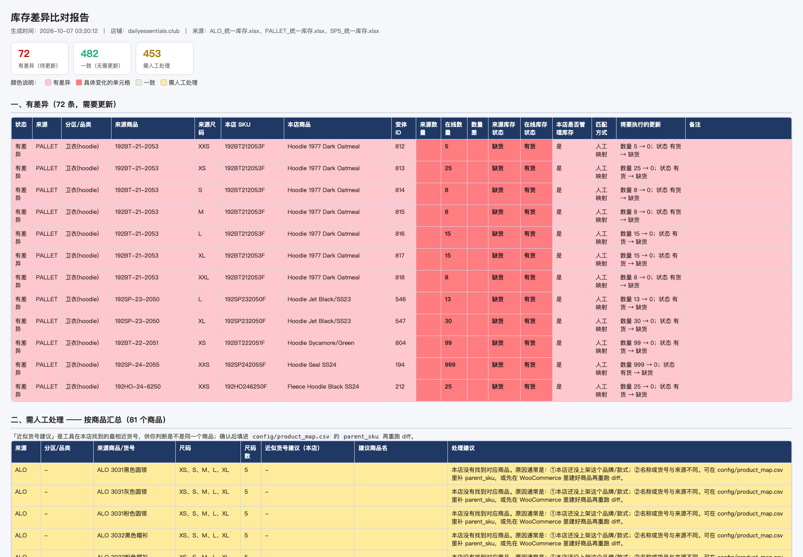
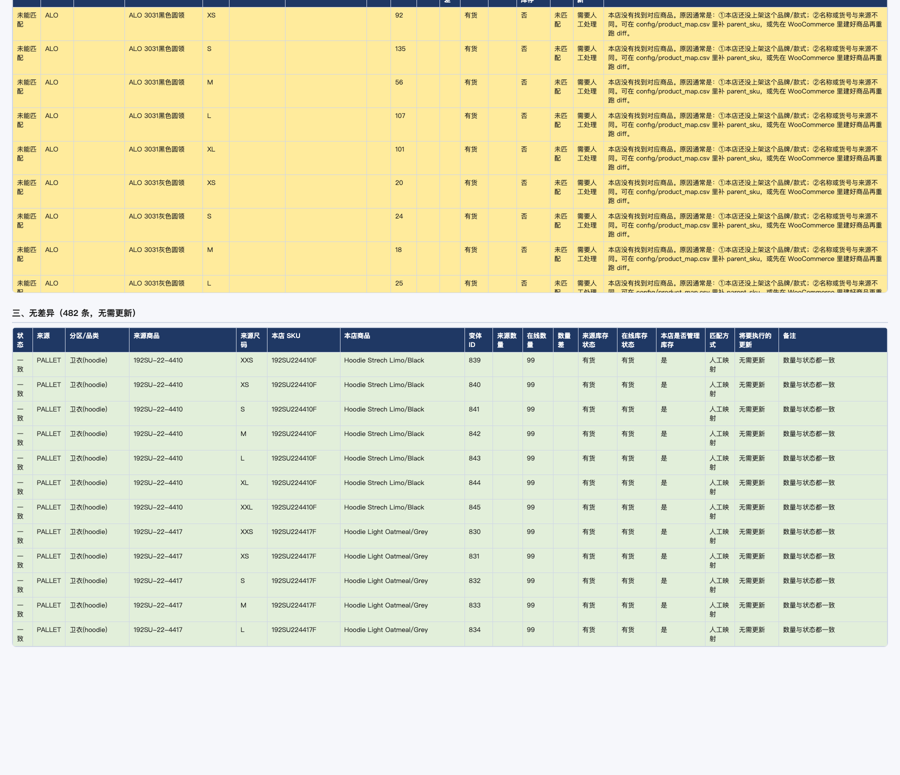

# skill-WangxiangInventory · 祥旺库存工具

**把一堆格式各异的库存文件，变成统一表格，和 WooCommerce 网店逐条比对，
用颜色标出差异，等你确认后才更新网店 —— 并告诉你每一条改成了什么。**

不用懂编程。会 **双击** 就够了。
**在你点头之前，它绝不会改动网店。**



*👆 实际生成的报表：红色=和网店不一样（深红格子是具体变化的那一项），黄色=网店没有这个商品*

---

## 30 秒了解

| 问题 | 回答 |
|---|---|
| 支持什么来源 | Excel 表格（自动处理合并单元格）、PDF「货盘」清单（✅ 表示有货） |
| 输出什么 | ① 统一格式的 Excel ② 带颜色的差异报表（网页/Excel/纯文本三种）③ 更新结果明细 |
| 会不会乱改网店 | **不会。** 必须你输入 `YES` 才更新；每次更新都自动留「后悔药」，可一键回滚 |
| 支持什么系统 | Windows 10/11、macOS、Linux |
| 要装什么 | Python 3.10+（**在 WorkBuddy 里连 Python 都不用装**，它自带） |
| 在哪能用 | 命令行、双击运行、WorkBuddy / Codex / Claude Code 等 AI 工具里直接对话调用 |

---

## 它解决的问题

档口/工作室的库存表格式五花八门：

| 现实中的库存文件 | 问题 |
|---|---|
| Excel：`商品名 / 尺码 / 数量`，还带合并单元格 | 每个供应商列的顺序都不一样 |
| PDF「货盘」：只有 ✅ 表示有货 | 根本没法直接喂给网店 |
| 一个 PDF 里塞了 8 个品牌分区 | 手工拆到怀疑人生 |

这个工具把它们**统一成同一种格式**，再和网店库存**逐条比对**，
把差异**用颜色标出来**给人确认，确认后才通过 WooCommerce REST API 批量更新。

---

## 三步上手

### 第 1 步 · 装一次

下载这个项目后，进入 `bin` 文件夹，双击：

| 你的电脑 | 双击 |
|---|---|
| **Windows** | `setup.bat` |
| **Mac** | `setup.command` |

黑窗口会自己找 Python、建独立环境、装依赖。第一次要联网，等 1~3 分钟。

> 在 **WorkBuddy** 里更省事：它自带 Python，安装脚本会自动找到，你什么都不用装。

### 第 2 步 · 填 3 行资料

用记事本打开 `config/config.yaml`：

```yaml
store:
  base_url: "你的域名.com"          # 不要写 https://，结尾不要加 /
  consumer_key: "ck_你的密钥"
  consumer_secret: "cs_你的密钥"
```

密钥怎么拿 → [`docs/04-WooCommerce密钥获取.md`](docs/04-WooCommerce密钥获取.md)

### 第 3 步 · 日常使用

在 `bin` 文件夹里**按顺序双击**三个文件：

| 顺序 | Windows | Mac | 做什么 | 会改网店吗 |
|---|---|---|---|---|
| 1 | `1-提取库存.bat` | `1-提取库存.command` | 读库存文件 → 统一表格 | ❌ |
| 2 | `2-差异比对.bat` | `2-差异比对.command` | 和网店比对 → 彩色报表 | ❌ |
| 3 | `3-同步更新.bat` | `3-同步更新.command` | 先演练，输入 `YES` 才真更新 | ✅ 才会 |

---

## 报表怎么看

每次比对生成三种格式，**内容一样，挑顺手的看**：

| 文件 | 怎么看 | 适合 |
|---|---|---|
| `库存差异_xxx.html` | **双击**，浏览器打开 | 最省事，颜色和中文一定不乱 |
| `库存差异_xxx.xlsx` | Excel 打开 | 要筛选、排序 |
| `库存差异_xxx.md` | 记事本打开 | 复制到微信发人 |

| 颜色 | 意思 |
|---|---|
| 🟥 红色 | 和网店不一样，**需要更新**（深红格子 = 具体变化的那一项） |
| 🟩 绿色 | 一模一样，不用管 |
| 🟨 黄色 | 网店里找不到这个商品，需人工看一眼（会给出**近似货号建议**） |



---

## 安全设计（重要）

| 机制 | 说明 |
|---|---|
| **不会偷偷改** | `sync` 默认只演练；只有加 `--yes` 或输入 `YES` 才真正提交 |
| **可一键回滚** | 每次更新自动生成快照，`wangxiang rollback <快照> --yes` 精确还原 |
| **不猜数字** | 来源说"有货"但网店数量是 0 时，工具不会瞎填，标为「需人工填数量」 |
| **匹配宁缺毋滥** | 货号/名称对不上就进「需人工处理」，绝不错配 |
| **密钥不外传** | 密钥只存在 `config/config.yaml`，已被 `.gitignore` 排除 |

---

## 命令参考

```bash
# 装环境（可反复执行，只补缺的）
python tools/bootstrap.py

# 离线自检：解析结果是否还和基线一致（不联网，约 30 秒）
python -m wangxiang selftest

# 环境 + 来源文件 + 网店连通性检查（联网）
python -m wangxiang check

# 三个主命令
python -m wangxiang extract                    # ① 读取库存文件 → 统一格式
python -m wangxiang diff                       # ② 和网店比对 → 彩色报表（只读）
python -m wangxiang sync                       # ③ 演练（不改网店）
python -m wangxiang sync --yes                 # ③ 真正更新（自动存回滚快照）
python -m wangxiang sync --ask                 # ③ 先演练，再用中文问你要不要更新

# 实用选项
python -m wangxiang sync --yes --only-source SP5       # 只同步某个来源
python -m wangxiang sync --yes --only-sku 192HO24      # 只同步含关键词的条目
python -m wangxiang diff --combo                       # 允许用「组合商品」货号匹配
python -m wangxiang map --write                        # 生成/更新商品映射表
python -m wangxiang rollback output/sync/回滚快照_xxx.json --yes   # 撤回
```

> **Windows** 把 `.venv/bin/python` 换成 `.venv\Scripts\python`。
> 也可以直接用安装时创建的短命令：`.venv/bin/wangxiang diff`（Windows：`.venv\Scripts\wangxiang diff`）。

---

## 技术要点

| 难点 | 怎么解决的 |
|---|---|
| **Excel 合并单元格** | 合并区域的值自动向下填充，同一「商品×尺码」去重 |
| **PDF 货盘的打勾识别** | 这份 PDF 的文字层里混着**白色/被盖住的 ✅**。改为把打勾格**渲染成图片按绿色像素判断**，850 个格子做到「552 个满格勾 / 298 个纯 0 像素 / **0 个模糊**」 |
| **一个 PDF 8 个品牌分区** | 按灰色标题条自动切分区，尺码序号不再递增就换商品，5码/6码/7码混排也能适配 |
| **个别尺码标签缺失** | 按上下顺序自动补出，避免整块错行 |
| **货号写法不一** | `192SU-22-4410` ↔ `192SU224410F` 自动归一（忽略 `-`、空格、大小写、结尾 F） |
| **同名商品** | 同分区重名自动加 `#1` `#2`，可分别映射 |
| **Windows 中文乱码** | `.bat` 保持纯 ASCII+CRLF（cmd 读批处理按字节读），中文一律由 Python 打印；控制台编码自动切 UTF-8，撑不住则降级为 `[OK]` 纯文本 |

---

## 项目结构

```
SKILL.md                    AI 工具用的技能说明（WorkBuddy / Codex / Claude Code）
README.md                   你正在看的这份
config/
  config.example.yaml       配置模板（可安全分发）
  config.yaml               你的真实配置（含密钥，已被 .gitignore 排除）
  product_map.csv           商品映射表：来源商品 → 网店货号
wangxiang/                  全部代码
  extract_excel.py          Excel 解析
  extract_pdf.py            PDF 货盘解析（像素级打勾识别）
  matching.py               商品匹配 + 映射表
  diff.py                   差异比对
  report.py                 彩色报表（HTML / Excel / Markdown）
  sync.py                   更新 + 回滚快照
  woo.py                    WooCommerce REST 客户端
  console.py                跨平台控制台兼容层
  runtime.py                跨平台运行时探测
  selftest.py               离线回归自检
tools/
  bootstrap.py              跨平台安装脚本（只用标准库）
  banner.py                 双击脚本的中文横幅
bin/                        各平台启动脚本（.bat / .command / .sh）
tests/baseline.json         回归基线（行数/商品数）
docs/                       12 篇帮助文档
demo-inventory/             示例数据（1 份 PDF + 2 份 Excel）
output/                     所有产物（已被 .gitignore 排除）
```

---

## 文档

**新手先看这两篇：**

| 文档 | 什么时候看 |
|---|---|
| [`docs/01-快速开始.md`](docs/01-快速开始.md) | 想 5 分钟跑通一遍 |
| [`docs/09-Windows使用指南.md`](docs/09-Windows使用指南.md) | **Windows 用户看这个** |
| [`docs/10-WorkBuddy使用指南.md`](docs/10-WorkBuddy使用指南.md) | 在 WorkBuddy 里用 |

**全部文档：**

| 文档 | 内容 |
|---|---|
| [`docs/02-安装与环境准备.md`](docs/02-安装与环境准备.md) | 装了什么、装不上怎么办 |
| [`docs/03-使用手册.md`](docs/03-使用手册.md) | 每条命令、每个参数、每个输出文件 |
| [`docs/04-WooCommerce密钥获取.md`](docs/04-WooCommerce密钥获取.md) | 密钥在哪生成 |
| [`docs/05-来源文件格式说明.md`](docs/05-来源文件格式说明.md) | 支持什么格式、怎么加新文件 |
| [`docs/06-商品映射表说明.md`](docs/06-商品映射表说明.md) | 报表里有黄色"找不到商品"怎么办 |
| [`docs/07-常见问题FAQ.md`](docs/07-常见问题FAQ.md) | 报错对照表（含 Windows / WorkBuddy 专章） |
| [`docs/08-交接与迁移.md`](docs/08-交接与迁移.md) | 给同事 / 换电脑 / 换店铺 |

---

## 环境要求

- **Python 3.10+**（推荐 3.12+；WorkBuddy 自带 3.13，会被自动选中）
- 依赖：`openpyxl` `pdfplumber` `numpy` `requests` `PyYAML`
  （精确版本见 `requirements.lock.txt`，装不上会自动回退到 `requirements.txt`）
- 全部装在项目自己的 `.venv` 里，**不污染系统**；删掉 `.venv` 就等于卸载

---

## 自检

改代码 / 换电脑 / 拿到别人的副本之后，先跑一次：

```bash
python -m wangxiang selftest
```

它会检查六件事（**不联网，也不需要密钥**）：

> 刚 `git clone` 下来、还没填 `config.yaml` 时也能直接跑：
> 工具会自动用 `config.example.yaml` 模板，并提示你还没填密钥。
> 只有**比对网店**（`diff` / `sync`）才必须填密钥。

1. 解析结果是否和基线一致（行数 / 商品数）
2. PDF 打勾识别是否还有模糊值
3. 商品映射表有没有重复键
4. SKU / 尺码 / 数量规范化逻辑是否正确
5. 三平台启动脚本是否齐全、`.bat` 是否纯 ASCII+CRLF、goto 标签是否对得上
6. 文档内部链接是否失效、跨平台说明是否缺失
